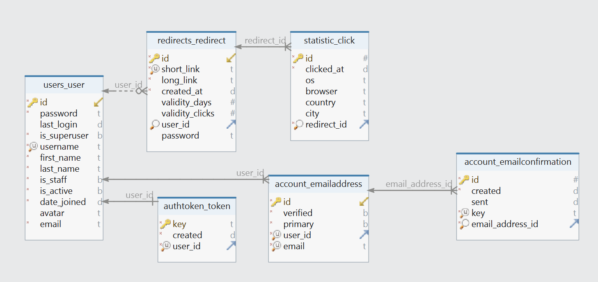

# [Datanar](https://datanar.ru) - сайт по сокращению ссылок

## Содержание
- [Введение](#введение)
- [Структура проекта](#структура-проекта)
   - [База данных](#база-данных)
- [Развёртывание](#Развёртывание)
   - [Установка Python](#установка-python)
   - [Установка Git](#установка-git)
     - [Windows](#windows)
     - [MacOS](#macos)
     - [Linux](#linux-debian--ubuntu)
   - [Клонирование репозитория](#клонирование-репозитория)
   - [Установка виртуального окружения](#установка-виртуального-окружения)
   - [Установка зависимостей](#установка-зависимостей)
   - [Настройка сервера](#настройка-сервера)
   - [Запуск сервера Django](#запуск-сервера-django)
- [Авторы](#авторы)


## Введение
[Datanar](https://datanar.ru) представляет собой сервис для сокращения ссылок,
который позволяет пользователям преобразовывать длинные URL-адреса в короткие 
и удобные для использования ссылки.

### Для чего может быть полезно сокращать ссылки:
- Для визуальной привлекательности
- Для удобства передачи не по сети
- Для отслеживания статистики переходов
- Для защиты конечного ресурса с помощью пароля

Это не новая идея и уже существуют множество сервисов с похожим функционалом,
вот их небольшой срез: 

| Сервис                                      | Регистрация | Кастомизация ссылки | QR-code | Статистика | Русский язык | Пароль  | API     |
|---------------------------------------------|-------------|---------------------|---------|------------|--------------|---------|---------|
| [clck.ru](https://clck.ru/)                 | Нет (+)     | Нет (-)             | Да (+)  | Нет (-)    | Да (+)       | Нет (-) | Да (+)  |
| [goo.su](https://goo.su/)                   | Нет (+)     | Нет (-)             | Да (+)  | Да (+)     | Да (+)       | Нет (-) | Да (+)  |
| [bitly.com](https://bitly.com/)             | Да (-)      | Да (+)              | Да (+)  | Да ($)     | Нет (-)      | Нет (-) | Да ($)  |
| [Innkin.com](https://www.lnnkin.com)        | Да (-)      | Да ($)              | Нет (-) | Да ($)     | Нет (-)      | Да ($)  | Да ($)  |
| [rebrandly.com](https://www.rebrandly.com/) | Нет (+)     | Да (+)              | Да (+)  | Да (+)     | Нет (-)      | Нет (-) | Да (+)  |
| [tinyurl.com](https://tinyurl.com)          | Нет (+)     | Да (+)              | Да (+)  | Да ($)     | Нет (-)      | Нет (-) | Да ($)  |
| [urlog.ru](https://urlog.ru/)               | Нет (+)     | Нет (-)             | Нет (-) | Да (+)     | Да (+)       | Да (+)  | Нет (-) |

(+) - функция есть; (-) - функции нет; ($) - функция платна

Но все они реализуют только часть функционала, цель же 
[Datanar](https://datanar.ru) предоставить пользователю его весь и сразу!

### С [Datanar](https://datanar.ru) вы можете:
- Сократить ссылку
- Получить сразу сгенерированный QR-code
- Указать свой собственный короткий url-адрес
- Отслеживать статистику переходов по ссылке
- Выгружать статистику в удобном формате
- Установить пароль для сокращённой ссылки
- Указывать до какой даты будет работать ссылка
- Указывать сколько переходов можно совершить по ссылке
- Связать свой сервис с нашим по API

### Используемые фреймворки / библиотеки
- [Bootstrap](https://getbootstrap.com/) - популярная (html / css / js) 
библиотека для фронтенда
- [Celery](https://docs.celeryq.dev/en/stable/) - очередь задач 
(в качестве брокера выступает [Redis](https://redis.io/))
- [Chart.js](https://www.chartjs.org/) - отрисовка диаграмм в статистике
- [DB-IP](https://db-ip.com) - определение страны и города переходящего по IP
- [Django](https://www.djangoproject.com/) - основной фреймворк web сервиса
- [Segno](https://github.com/heuer/segno/) - генерация QR-кодов
- [Sqids](https://sqids.org/) - для помощи в генерации сокращённых ссылок

## Структура проекта

### База данных

Функциональная структура базы данных следующая:


Основных моделей две - Redirect и Click
- Redirect - хранит в себе связь между длинной и короткой ссылкой
- Click - хранит информацию о переходе по redirect 
(Для статистики и для ограничения по переходам)

## Развёртывание

### Установка Python
Для запуска этого проекта вам потребуется Python. 
  
Если у вас его еще нет, вы можете скачать его с официального 
[сайта](https://www.python.org/downloads/), рекомендуется установить версию в 
диапазоне 3.8 - 3.11

### Установка Git

#### Windows

1. Скачайте установщик Git с официального 
[сайта](https://git-scm.com/download/win)
2. Запустите установщик и следуйте инструкциям на экране.

#### MacOS

1. Откройте терминал.
2. Установите [Homebrew](https://brew.sh/), если у вас его еще нет, с помощью 
   следующей команды:
    ```bash
    /bin/bash -c"$(curl -fsSL https://raw.githubusercontent.com/Homebrew/install/HEAD/install.sh)"
    ```
3. Установите Git с помощью команды:
    ```bash
    brew install git
    ```
    
#### Linux (Debian / Ubuntu)
    
1. Откройте терминал.
2. Обновите список пакетов:
    ```bash
    sudo apt update
    ```
3. Установите Git с помощью следующих команд:
    ```bash
    sudo apt install git
    ```
  
После установки Git вы можете проверить его версию и убедиться, что он 
установлен правильно, с помощью команды `git --version`. 
Эта команда должна вывести версию Git на экран.

### Клонирование репозитория

1. Откройте терминал (cmd для Windows, Terminal для Mac).
2. Перейдите в директорию, где вы хотите сохранить проект, используя команду 
`cd`. Например: `cd C:\Users\YourUsername\Documents`
3. Клонируйте репозиторий, используя следующую команду:
    ```bash
    git clone https://gitlab.crja72.ru/django_2023/projects/datanar.git
    ```

### Установка виртуального окружения

1. В терминале перейдите в директорию проекта:
   ```bash
   cd datanar
   ```

2. Создайте виртуальное окружение:
   - На Windows:
       ```bash
       python -m venv venv
       ```
   - На Mac или Linux:
       ```bash
       python3 -m venv venv
       ```
   Стоит отметить, что не всегда на linux будет работать python3, а на windows 
   python, попробуйте оба варианта.

3. Активируйте виртуальное окружение:
   - На Windows:
   ```bash
   venv\Scripts\activate
   ```
   - На Mac или Linux:
   ```bash
   source venv/bin/activate
   ```

### Установка зависимостей

Установите все необходимые пакеты, используя следующую команду: 
```bash
pip install -r requirements/prod.txt
```
Опять, стоит отметить, что возможны два варианта - `pip` или `pip3`, зависит
от вашей ОС.

Также добавьте файл `.env` в текущую директорию со следующим содержанием:
```
DJANGO_DEBUG=True
DJANGO_SECRET_KEY=this_is_test_key_-_some_very_dummy_secret_key
DJANGO_ALLOWED_HOSTS=*
DJANGO_MAIL_HOST=smtp.mail.ru
DJANGO_MAIL_PORT=2525
DJANGO_MAIL_USER=webmaster@localhost
DJANGO_MAIL_PASSWORD=this_very_secret_password_for_smtp_mail
DEFAULT_USER_IS_ACTIVE=False
```
`DJANGO_SECRET_KEY`, `DJANGO_ALLOWED_HOSTS` замените на свои значения.

`DJANGO_MAIL_HOST`, `DJANGO_MAIL_PORT`, `DJANGO_MAIL_USER`,
`DJANGO_MAIL_PASSWORD` - настройки почтового сервиса, используйте свои.

Настройка `DEFAULT_USER_IS_ACTIVE=False` - означает, что перед использованием 
сервиса обязательно требуется подтверждённая почта, установите `True`, если
этого не нужно

Также структура `.env` продублирована `.env.example` для удобства.

С помощью следующей команды, вы можете, сразу создать и скопировать данные из 
`.env.example` в `.env`
- На Windows:
    ```bash
    copy .env.example .env
    ```
- На Mac или Linux:
    ```bash
    cp .env.example .env
    ```
  
Если не добавить `.env` или просто продублировать информацию из `.env.example` 
в `.env`, приложение будет запущено с дефолтными настройками, что 
не рекомендуется по соображениям безопасности.

### Настройка сервера

Скомпилируйте файлы локализации данного проекта: 
```bash
django-admin compilemessages
```

Перейдите в директорию `datanar`
```bash
cd datanar
```

Создайте миграции для базы данных.
```bash
python3 manage.py migrate
```

Также сделайте сбор статики, если будет предупреждение про перезапись файлов 
введите "yes":
```bash
python3 manage.py collectstatic
```

Ещё нужно будет создать суперпользователя (админа) сайта.
```bash
python3 manage.py createsuperuser
```
Введите логин, почту и пароль суперпользователя.

В зависимости от настроек, перед попаданием в админ панель вам может 
потребоваться подтвердить свою почту.

Теперь можете зарегистрироваться с этими данными на сайте и в правом верхнем 
углу, нажав на свою аватарку, в списке вы увидите пункт "Админка", 
которая и приведёт вас в админ панель.

### Запуск сервера Django

Запустите сервер Django с помощью следующей команды: 
```bash
python3 manage.py runserver
```

Помните, что Django в прод режиме (т.е. сейчас) не отдаёт статику 
(например картинки) по соображениям оптимизации, для этого нужно настроить 
отдельный web-сервер. Или же запустить Django в режиме разработки.

Если вы хотите запустить Django в режиме разработки, то не забудьте установить 
дополнительные зависимости: 
```bash
cd ..
```
```bash
pip install -r requirements/test.txt
```
```bash
cd datanar
```
А в файле `.env` перевести переменную `DJANGO_DEBUG` в `True`:
```
DJANGO_DEBUG=True
...
```

Установив зависимости `test.txt`, вы также получите возможность запустить тесты для локальной проверки целостности проекта:
```bash
python3 manage.py test
```

Ожидаемый результат после выполнения команды: `OK`

***

После запуска вы должны иметь возможность открыть проект в браузере по адресу http://127.0.0.1:8000/.

Вы потрясающие! ©

## Авторы

Андреев Сергей [@Gray_Advantage](https://t.me/Gray_Advantage)


Клименко Владимир [@brandonzorn](https://t.me/brandonzorn)


Третьяков Артем [@piper273](https://t.me/piper273)