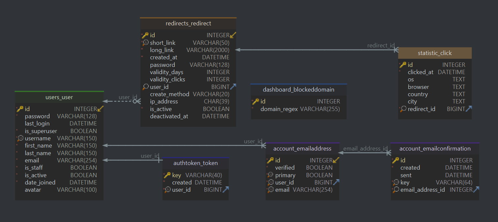

# [Datanar](https://datanar.ru) - сайт по сокращению ссылок

---

## Содержание
- [Введение](#введение)
  - [Полезность](#для-чего-может-быть-полезно-сокращать-ссылки)
  - [Существующие решения](#существующие-решения)
  - [Возможности datanar](#с-datanar-вы-можете)
- [Структура проекта](#структура-проекта)
  - [Стек технологий](#используемые-фреймворки--библиотеки)
  - [База данных](#база-данных)
  - [Контейнеры docker](#контейнеры-docker)
- [Развёртывание](#развёртывание)
  - [Нативная установка](#нативная-установка)
  - [Контейнеризация docker](#контейнеризация-docker)
- [Авторы](#авторы---эти-прекрасные-люди)

---

## Введение
[Datanar](https://datanar.ru) представляет собой сервис для сокращения ссылок,
который позволяет пользователям преобразовывать длинные URL-адреса в короткие 
и удобные для использования ссылки.

### Для чего может быть полезно сокращать ссылки:
- Для визуальной привлекательности
- Для удобства передачи ссылки не по сети (в разговоре или в выводе на экран)
- Для отслеживания статистики переходов
- Для защиты конечного ресурса с помощью пароля

### Существующие решения
Это не новая идея и уже существуют множество сервисов с похожим функционалом,
вот их небольшой срез: 

| Сервис                                      | Регистрация | Кастомизация ссылки | QR-code | Статистика | Русский язык | Пароль  | API     |
|---------------------------------------------|-------------|---------------------|---------|------------|--------------|---------|---------|
| [clck.ru](https://clck.ru/)                 | Нет (+)     | Нет (-)             | Да (+)  | Нет (-)    | Да (+)       | Нет (-) | Да (+)  |
| [goo.su](https://goo.su/)                   | Нет (+)     | Нет (-)             | Да (+)  | Да (+)     | Да (+)       | Нет (-) | Да (+)  |
| [bitly.com](https://bitly.com/)             | Да (-)      | Да (+)              | Да (+)  | Да ($)     | Нет (-)      | Нет (-) | Да ($)  |
| [Innkin.com](https://www.lnnkin.com)        | Да (-)      | Да ($)              | Нет (-) | Да ($)     | Нет (-)      | Да ($)  | Да ($)  |
| [rebrandly.com](https://www.rebrandly.com/) | Нет (+)     | Да (+)              | Да (+)  | Да (+)     | Нет (-)      | Нет (-) | Да (+)  |
| [tinyurl.com](https://tinyurl.com)          | Нет (+)     | Да (+)              | Да (+)  | Да ($)     | Нет (-)      | Нет (-) | Да ($)  |
| [urlog.ru](https://urlog.ru/)               | Нет (+)     | Нет (-)             | Нет (-) | Да (+)     | Да (+)       | Да (+)  | Нет (-) |

(+) - функция есть; (-) - функции нет; ($) - функция платна

Но все они реализуют только часть функционала, цель же 
[Datanar](https://datanar.ru) предоставить пользователю его весь и сразу!

### С [Datanar](https://datanar.ru) вы можете:
- Сократить ссылку
- Получить сразу сгенерированный QR-code
- Указать свой собственный короткий url-адрес
- Отслеживать статистику переходов по ссылке
- Выгружать статистику в удобном формате
- Установить пароль для сокращённой ссылки
- Указывать до какой даты будет работать ссылка
- Указывать сколько переходов можно совершить по ссылке
- Связать свой сервис с нашим по API

---

## Структура проекта
### Используемые фреймворки / библиотеки
- [Bootstrap](https://getbootstrap.com/) - популярная (html / css / js) 
  библиотека для фронтенда
- [Celery](https://docs.celeryq.dev/en/stable/) - очередь задач 
  (в качестве брокера сообщений выступает [Redis](https://redis.io/))
- [Chart.js](https://www.chartjs.org/) - отрисовка диаграмм в статистике
- [DB-IP](https://db-ip.com) - определение страны и города переходящего по IP
- [Django](https://www.djangoproject.com/) - основной фреймворк web сервиса
- [Docker](https://www.docker.com/) - развёртывание сайта на удалённом сервере
- [Segno](https://github.com/heuer/segno/) - генерация QR-кодов
- [Sqids](https://sqids.org/) - для помощи в генерации сокращённых ссылок

### База данных
Функциональная структура базы данных следующая:

Основных моделей три - `Redirect`, `Click` и `BlockedDomain`
- `Redirect` - хранит в себе связь между длинной и короткой ссылкой
- `Click` - хранит информацию о переходе по `Redirect`
(Для статистики и для ограничения по количеству переходов)
- `BlockedDomain` - регулярное выражение, описывающие url-адреса, которые
запрещены для сокращения 

### Контейнеры docker
Проект развёрнут с помощью технологии контейнеризации docker compose и имеет 
следующие [контейнеры](docker-compose.yml):

- [Postgres](https://hub.docker.com/_/postgres) - мощная и современная СУБД,
  используется как основная БД проекта
- [Django](Dockerfile) - собственный контейнер на базе 
  [python 3.12](https://hub.docker.com/_/python) c исходным кодом проекта
- [Nginx-prod](https://hub.docker.com/r/jonasal/nginx-certbot) - 
  модифицированная версия классического nginx контейнера, добавлен certbot для
  автоматического создания и продления SSL сертификатов для https соединения
- [Nginx-dev](https://hub.docker.com/_/nginx) - обратный прокси-сервер, нужен 
  для обслуживания статических запросов, применяется только во время разработки
- [Redis](https://hub.docker.com/_/redis) - быстрый сервер баз данных типа 
  ключ-значение. Требуется для celery
- [Celery](Dockerfile) - контейнер, созданный на базе `Django`, но с 
  изменённой командой запуска

---

## Развёртывание
Данная документация предлагает два основных способа запуска (развёртывания)
приложения:
### [Нативная установка](docs/native-install.md)
- подразумевает загрузку всего необходимого ПО непосредственно на локальную
  машину, с последующей ручной установкой и настройкой каждого компонента.
  Долгий и трудный путь, зато вы имеете полный контроль над всем происходящим

### [Контейнеризация docker](docs/docker-install.md)
- подразумевает загрузку одной единственной программы и её настройку, а дальше
  запуск всего приложения в полной комплектации с помощью одной команды.
  Быстрый и простой путь, большая часть вопросов уже решена, остальное дело
  техники

---

## Авторы - эти прекрасные люди:

  
  Андреев Сергей (<a href="https://github.com/Gray-Advantage">Github</a> | <a href="https://t.me/Gray_Advantage">Telegram</a>)

 

  
  Клименко Владимир (<a href="https://github.com/brandonzorn">Github</a> | <a href="https://t.me/brandonzorn">Telegram</a>)

 

  
  Третьяков Артем (<a href="https://github.com/Artem037">Github</a> | <a href="https://t.me/piper273">Telegram</a>)

